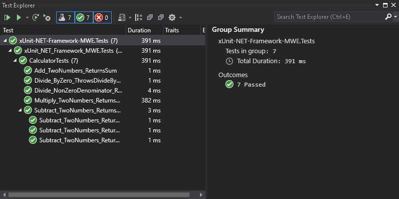
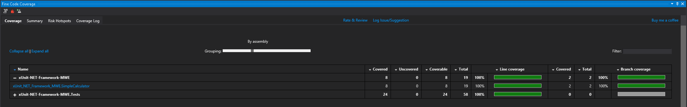

# xUnit .NET Framework Testing Guide

A minimal working example of using xUnit with .NET Framework 4.8 in Visual Studio 2019 Professional, including code coverage with Fine Code Coverage extension.

## Prerequisites

- Visual Studio 2019 Professional
- .NET Framework 4.8
- Fine Code Coverage extension for Visual Studio

## Setup Instructions

This tutorial assumes you already have a .NET Framework class library with a simple Calculator class. We'll focus on adding unit tests with xUnit and measuring code coverage.

### 1. Create a Test Project

1. Right-click on the solution in Solution Explorer
2. Select "Add" → "New Project..."
3. Search for "Class Library (.NET Framework)"
4. Select it and click "Next"
5. Name it "xUnit-NET-Framework-MWE.Tests" and click "Create"
6. Set target framework to .NET Framework 4.8

### 2. Add NuGet Packages to Test Project

1. Right-click on the test project
2. Select "Manage NuGet Packages..."
3. Go to "Browse" tab
4. Search for and install:
   - `xunit`
   - `xunit.runner.visualstudio`
   - `Microsoft.NET.Test.Sdk`

### 3. Add Reference to Main Project

1. Right-click on "References" in the test project
2. Select "Add Reference..."
3. In the "Projects" tab, check your main project
4. Click "OK"

### 4. Write Test Cases

Create a `CalculatorTests.cs` file with test methods for your calculator functionality:

```csharp
[Fact]
public void Add_TwoNumbers_ReturnsSum()
{
    // Arrange
    int a = 5, b = 10;

    // Act
    int result = _calculator.Add(a, b);

    // Assert
    Assert.Equal(15, result);
}
```

### 5. Build the Solution

1. Press Ctrl+Shift+B or select Build → Build Solution
2. Ensure there are no build errors

### 6. Run Tests



1. Open Test Explorer (Test → Test Explorer)
2. Click "Run All Tests" in the Test Explorer window
3. All tests should pass (green checkmarks)

### 7. Install Fine Code Coverage

1. Go to Extensions → Manage Extensions
2. Search for "Fine Code Coverage"
3. Click "Download"
4. Close Visual Studio when prompted
5. Complete the installation and restart Visual Studio

### 8. View Coverage Results



1. Go to View → Other Windows → Fine Code Coverage
2. The Fine Code Coverage pane will open at the bottom of Visual Studio
3. **Note:** You may need to expand the panel upward manually to see the visualizations
4. Green bars indicate covered code, red bars indicate uncovered code

## Understanding xUnit Test Attributes

- **[Fact]**: Marks a method as a test that always runs the same way
- **[Theory]**: Marks a method as a parameterized test
- **[InlineData]**: Provides data for a theory test method

## Common Assertion Patterns

```csharp
// Equality
Assert.Equal(expected, actual);

// Exceptions
Assert.Throws<ExceptionType>(() => methodThatThrows());
```

## License

This project is licensed under the WTFPL License - see the [LICENSE](LICENSE) file for details.
